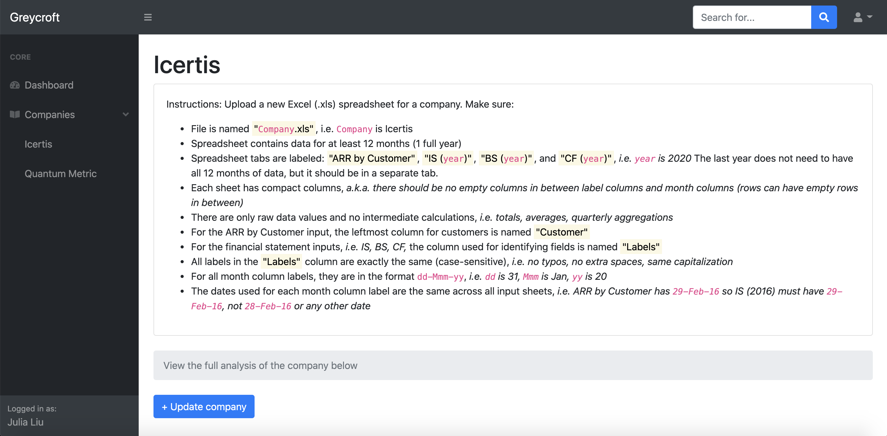

[![Contributors][contributors-shield]][contributors-url]
[![Forks][forks-shield]][forks-url]
[![Stargazers][stars-shield]][stars-url]
[![Issues][issues-shield]][issues-url]
[![MIT License][license-shield]][license-url]


<!-- PROJECT LOGO -->
<br />
<p align="center">
  <a href="https://github.com/juliasliu/application">
    
  </a>

  <h3 align="center">Greycroft Dashboard</h3>

  <p align="center">
    Data analysis and benchmarking of companies using raw customer revenue inputs and financial statements
    <br />
    <br />
    <a href="https://github.com/juliasliu/application"><strong>Explore the docs »</strong></a>
    <br />
    <br />
    <a href="https://github.com/juliasliu/application">View Demo</a>
    ·
    <a href="https://github.com/julialiu/application/issues">Report Bug</a>
    ·
    <a href="https://github.com/juliasliu/application/issues">Request Feature</a>
  </p>
</p>


<!-- TABLE OF CONTENTS -->
<details open="open">
  <summary><h2 style="display: inline-block">Table of Contents</h2></summary>
  <ol>
    <li>
      <a href="#about-the-project">About The Project</a>
      <ul>
        <li><a href="#built-with">Built With</a></li>
      </ul>
    </li>
    <li>
      <a href="#getting-started">Getting Started</a>
      <ul>
        <li><a href="#prerequisites">Prerequisites</a></li>
        <li><a href="#installation">Installation</a></li>
        <li><a href="#structure">File Structure</a></li>
      </ul>
    </li>
    <li><a href="#roadmap">Roadmap</a></li>
    <li><a href="#contributing">Contributing</a></li>
    <li><a href="#license">License</a></li>
    <li><a href="#contact">Contact</a></li>
  </ol>
</details>


<!-- ABOUT THE PROJECT -->
## About The Project




### Built With

* [Flask](https://flask.palletsprojects.com/en/1.1.x/)
* [Pandas](https://pandas.pydata.org/docs/)
* [Start Bootstrap](https://startbootstrap.com/template/sb-admin)
* [jQuery](https://jquery.com/)


<!-- GETTING STARTED -->
## Getting Started

To get a local copy up on your own computer and running follow these simple steps.

### Prerequisites

1. Python v3.8.5
2. Pip v20.2.4
3. Flask v1.1.2

### Installation

1. Clone the repo
   ```sh
   git clone https://github.com/juliasliu/application.git
   ```
2. Activate the Python venv environment
   ```sh
   . venv/bin/activate
   ```
3. Set environment variables
    ```sh
    export FLASK_APP=flaskr
    export FLASK_ENV=development
    ```
4. Install Python modules
    ```sh
    pip install
    ```
5. Run the Flask server
    ```sh
    flask run
    ```

### Structure

    .
    ├── ...
    ├── css                     # CSS styles for the web app frontend
    │   ├── dashboard.css       # custom stylesheet for dashboard pages
    │   ├── styles.css          # preloaded stylesheet from the Start Bootstrap dashboard template
    │   └── ...                 # etc.
    ├── flaskr                  # Python server code for receiving requests from JS frontend and running Pandas scripts for data analysis
    |   ├── __init__.py         # Initial Python script for routing and main function calls
    │   ├── rev_analysis.py     # Rev Analysis script
    │   ├── cohort_analysis.py  # Cohort Analysis script
    │   ├── dashboard.py        # Dashboard script
    |   ├── cac.py              # CAC script
    |   ├── payback_chart.py    # Payback Chart script
    │   ├── rev_charts.py       # Rev Charts script
    │   ├── benchmark.py        # Benchmark script for multiple companies
    │   ├── helpers.py          # helper methods for Python scripts
    │   └── ...                 # etc.
    ├── inputs                  # example company raw input data in the form of Excel spreadsheets
    |   ├── Icertis.xlsx        # raw input data for Icertis
    │   ├── Quantum Metric.xlsx # raw input data for Quantum Metric
    │   └── ...                 # etc.
    ├── js                      # JS scripts for the website frontend
    |   ├── analysis.js         # for uploading raw input data and displaying data and graphs in HTML pages
    │   ├── scripts.js          # preloaded script from the Start Bootstrap dashboard template
    │   └── ...                 # etc.
    ├── pages                   # HTML pages for the website frontend
    |   ├── company.html        # template for each individual company you upload
    │   └── ...                 # etc.
    ├── venv                    # a Python virtual environment where Flask and other dependencies are installed
    │   └── ...                 # etc.
    └── ...


<!-- ROADMAP -->
## Roadmap

See the [open issues](https://github.com/juliasliu/application/issues) for a list of proposed features (and known issues).
- [ ] Make interactive charts & graphs using the [Chart.js third-party plugin](https://www.chartjs.org/docs/latest/)
- [ ] Show loading spinner overlay when frontend is waiting for backend scripts to finish
- [ ] Connect the website to a SQLite backend database with Flask using [the tutorial](https://flask.palletsprojects.com/en/1.1.x/tutorial/database/)
- [ ] Upload and save companies to the database, and route the company cards on the Dashboard page to individual company pages (also located in the sidebar dropdown nav)
- [ ] Individual company pages should show uploaded input data, output data, and charts. Data can be updated by uploading a newer version of the input spreadsheet and saving it to the database.
- [ ] Implement Export to Excel spreadsheet functionality for the output data tables and charts
- [ ] Show specific error messages for invalid data inputs
- [ ] Implement authentication functionality, i.e. Register, Login for users within organizations
- [ ] Add more display flexibility for data tables, i.e. search bar, filter, sort, hide columns
- [ ] Accept each type of financial statement input all in one tab instead of spread out across different years


<!-- CONTRIBUTING -->
## Contributing

1. Fork the Project
2. Create your Feature Branch (`git checkout -b feature/AmazingFeature`)
3. Commit your Changes (`git commit -m 'Add some AmazingFeature'`)
4. Push to the Branch (`git push origin feature/AmazingFeature`)
5. Open a Pull Request


<!-- LICENSE -->
## License

This project is under Greycroft.


<!-- CONTACT -->
## Contact

Julia Liu - [Email](julia5sliu@gmail.com)

Project Link: [https://github.com/juliasliu/application](https://github.com/juliasliu/application)


<!-- MARKDOWN LINKS & IMAGES -->
<!-- https://www.markdownguide.org/basic-syntax/#reference-style-links -->
[contributors-shield]: https://img.shields.io/github/contributors/juliasliu/application.svg?style=for-the-badge
[contributors-url]: https://github.com/juliasliu/application/graphs/contributors
[forks-shield]: https://img.shields.io/github/forks/juliasliu/application.svg?style=for-the-badge
[forks-url]: https://github.com/juliasliu/application/network/members
[stars-shield]: https://img.shields.io/github/stars/juliasliu/application.svg?style=for-the-badge
[stars-url]: https://github.com/juliasliu/application/stargazers
[issues-shield]: https://img.shields.io/github/issues/juliasliu/application.svg?style=for-the-badge
[issues-url]: https://github.com/juliasliu/application/issues
[license-shield]: https://img.shields.io/github/license/juliasliu/application.svg?style=for-the-badge
[license-url]: https://github.com/juliasliu/application/blob/master/LICENSE.txt
